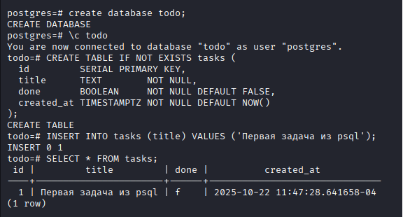
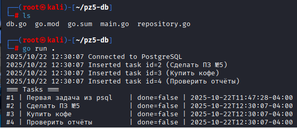
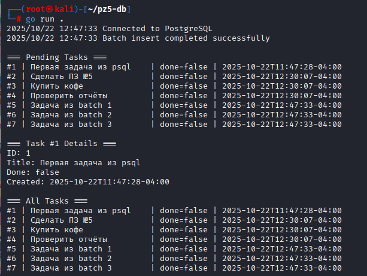

## практическа работа 5

### ЭФМО-02-25 Фомичев Александр Сергеевич

#### Структура проекта
```
pz5-db/
  main.go
  db.go
  repository.go
  go.mod
  .env           
```
### Цели:
1.	Установить и настроить PostgreSQL локально.
2.	Подключиться к БД из Go с помощью database/sql и драйвера PostgreSQL.
3.	Выполнить параметризованные запросы INSERT и SELECT.
4.	Корректно работать с context, пулом соединений и обработкой ошибок.
 

## создание БД



## запуск и проверка

.png)

**Список**



**Получение по id**




